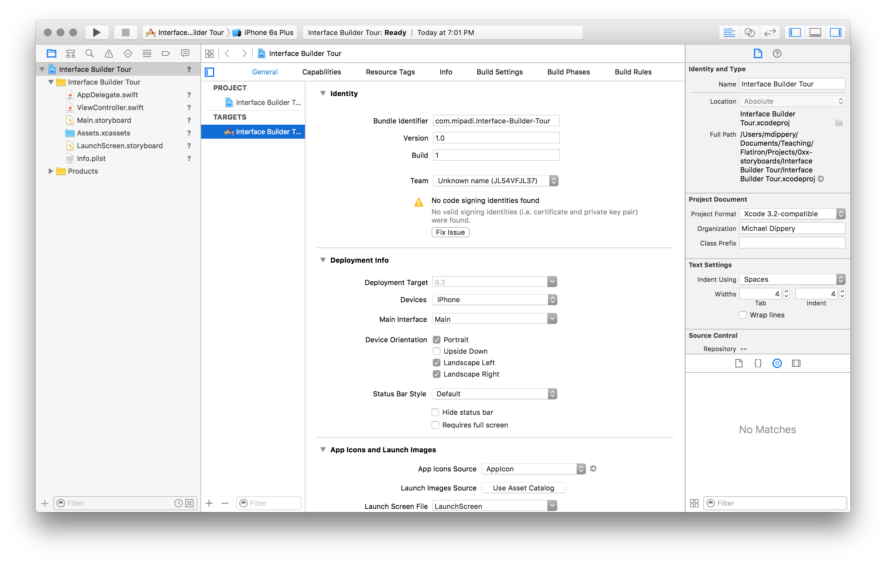
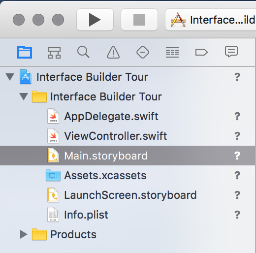
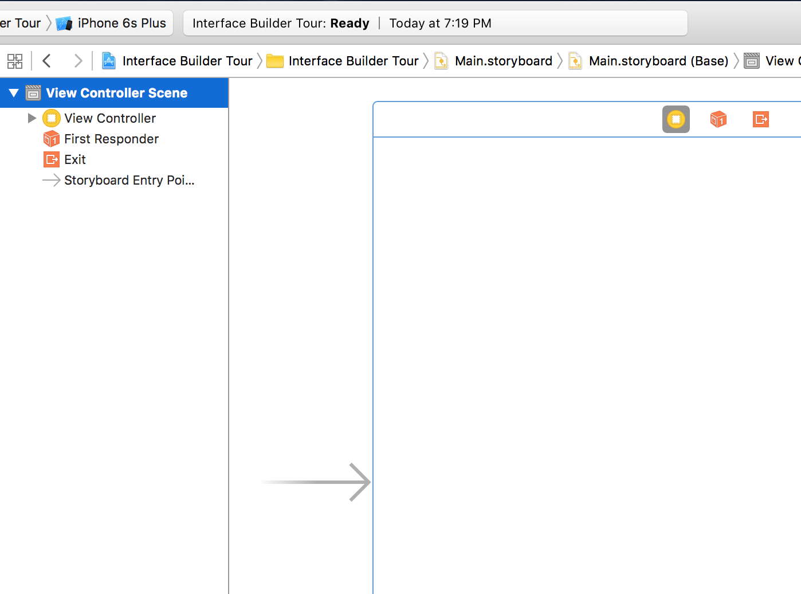
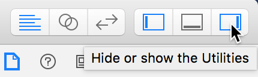
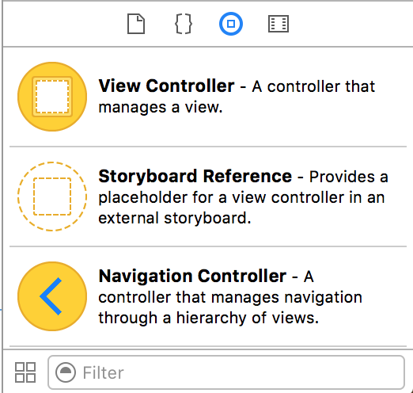
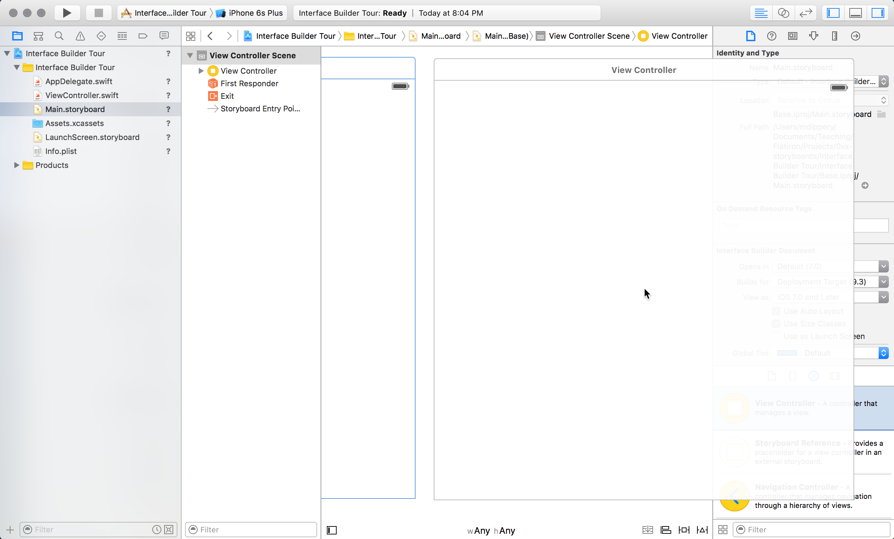

# Interface Builder & Storyboard

> The flower that blooms in adversity is the rarest and most beautiful of all.

## Learning Objectives - The student should be able to...

* Explain that *Interface Builder* allows developers to create interfaces for applications using a graphical user interface (GUI). 
* Navigate to *Interface Builder* from Xcode.
* Explain that a `.storyboard` file is single file in Xcode that shows the flow of the various screens that will make an app.
* Navigate to the Development Info section after selecting their target in the Project navigator
* Navigate to the Object Library.
* Drag a View Controller onto the canvas and understands that this is referred to as a scene.

## Interface Builder

You can think of Xcode as two fundamental parts: An _editor_, where you write the Swift code that makes your application run; and _Interface Builder_, which is the part where you lay out the graphical interface of your program—the buttons, toolbars, menus, images, and text that make up how your users interact with your program. Interface Builder is an important part of your Swift programming toolset.

These two components, the editor and Interface Builder, are both parts of _Xcode_, and together, allow you to easily and rapidly develop both iOS and OS X graphical programs. The great thing about Xcode is that it allows you to lay out your program's interface using graphical tools, then easily connect the graphical components of your program to Swift code that makes them work.

In this lesson, you'll get a quick introductory tour to Interface Builder. Start that tour by creating an Xcode project for a new iOS program. For this lesson, you can just use Xcode's Single View Application template. After creating this project, you'll be greeted with Xcode's standard editing window:

Take a look at the file listing on the left-hand side of the window. You should see two `.storyboard` files: `Main.storyboard` and `LaunchScreen.storyboard`.

## Storyboards

Storyboards (`.storyboard` files) are where you lay out the graphical interface of your iOS program. By default, an Xcode project includes both a `LaunchScreen.storyboard` file and a `Main.storyboard` file. `LaunchScreen.storyboard` is where you lay out the interface that you see when your program is in the process of launching—its "splash screen". These are important, but you won't focus on `LaunchScreen.storyboard` in this lesson.

`Main.storyboard` is the main graphical interface of your program. It is the first thing your user will see after your program is done launching. You can think of it as the "entry point" of your iOS program. It is in this storyboard that you will place the initial controls—text boxes, buttons, toolbar items, and so forth—that will allow your user to navigate to the rest of your program. Some simple programs may _only_ have this single interface.

Open up `Main.storyboard` by clicking once on it in the file listing. You'll see it open in Interface Builder. Right now, it's pretty plain—just a large white box!

Right now, there is one _object_ on the storyboard: A blank white box called **View Controller**. A view controller is an object that is responsible for drawing the graphical interface, as well as managing interactions with it (touches, swipes, pokes, and so forth). You will be learning _a lot_ more about view controllers in the upcoming lessons, but for now, just know that it is responsible for managing how the interface _looks_.

Notice that on the left side of the view controller's rectangle is a grey arrow pointing to it (you may have to scroll a bit to the left to see it). That arrow indicates that this view controller is the entry point of your application. It's the first thing a user will see when they run your application.

You should also notice that on the left hand side of the Interface Builder window, next to the file listing, is a list of items. This area is the _object listing_. The topmost item is labeled **View Controller Scene**. Click once on this item. You should notice that the big blank view controller rectangle in the editing window is highlighting. **View Controller Scene** in the object listing corresponds to that view controller rectangle in the editing portion.

### Scenes

Have you ever seen a storyboard for a movie? It consists of drawings for key scenes of a movie, and shows how the story flows and what the movie will look like at each scene. iOS development uses a similar model to lay out graphical interfaces. An iOS app consists of one or more _screens_ which display text, images, icons—anything you want to show to the user. You move between these screens using controls like buttons.

Think about the iPhone's Contacts app. When you launch the app, you're presented with a list of family and friends. Tapping on an item in the list slides to a new screen that shows all the contact info for that person. The list of contacts is the initial view of the application, and the contact details are a separate view.

You store the layout of these different screens in the storyboard file. In keeping with the movie analogy, each screen is referred to as a _scene_. Generally, each scene has its own view controller. These screens are connected to each other in different ways, allowing you to easily move between them. The overall design and interaction of these screens is visible in the storyboard file, which allows you to have a high-level overview of the flow of your application.

No better way to understand this than to see it in action!

Let's add another scene to the storyboard. Remember that scenes have a view controller associated with them, so to add a scene, you add a new view controller object to the storyboard. And you add a new view controller object by dragging it from the _object library_ onto your storyboard. But let's not get ahead of ourselves! First, make sure that you can see the right-hand sidebar of the Interface Builder. If you don't, click the button in the top right corner of Xcode's window:

You should see this sidebar along the right-hand side of your screen:

The _object library_ is the portion at the bottom of the sidebar, with a bunch of yellow blobs and some text:

Look! There's already an icon marked **View Controller**, so you don't even have to waste time searching for it. (You use view controllers _a lot_ in iOS development, so Xcode makes sure they're readily available.) You can add a new view controller—or _scene_—to your storyboard by clicking on the yellow **View Controller** icon and _dragging_ it onto your storyboard. Place it next to (not on top of!) the existing view controller.

Congratulations! You've added a new scene to your storyboard!

That's all we're going to worry about for now. In the upcoming lessons, you'll learn a lot more about laying out your applications graphical interface, including how to add buttons and text, and wire these scenes together so you can navigate between them. But for now, just relish in the fact that you have created a storyboard with _two scenes!_

<a href='https://learn.co/lessons/InterfaceBuilder' data-visibility='hidden'>View this lesson on Learn.co</a>
